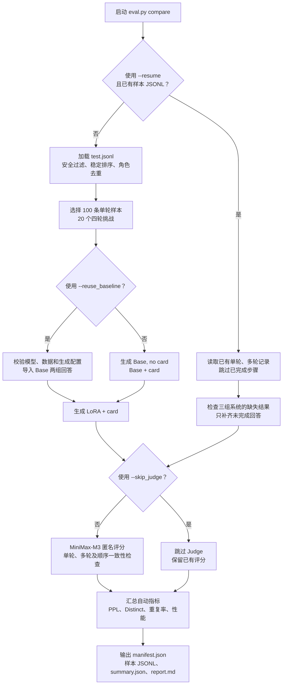

# 基于 LoRA 微调的角色扮演对话生成

使用 LoRA (Low-Rank Adaptation) 技术对小型 LLM（Qwen2.5-3B-Instruct）进行高效微调，实现角色扮演对话生成。

## 项目成员

| 姓名 | 学号 | 分工 |
|------|------|------|
| 刘易函 | | |
| 廖绪丞 | | |
| 龙泓潭 | | |

## 快速开始

### 1. 克隆代码仓库

```bash
git clone git@github.com:yeunmer2006/26ML-roleplay-lora.git
cd 26ML-roleplay-lora
```

### 2. 创建 conda 环境并安装依赖

```bash
conda create -n ml_roleplay python=3.10 -y
conda activate ml_roleplay
pip install -r requirements.txt
```

### 3. 验证环境

```bash
python -c "import torch; print(f'CUDA: {torch.cuda.is_available()}, GPU: {torch.cuda.get_device_name(0) if torch.cuda.is_available() else \"None\"}')"
```

### 4. 准备基座模型

模型约 6GB。准备脚本会依次检查用户指定目录、项目内 `models/` 和
`.cache/`、Hugging Face 标准缓存、ModelScope 标准缓存。检查会验证
tokenizer、权重索引和全部权重分片，找到完整模型后不会重复下载。

本地没有完整模型时，会优先从 Hugging Face 下载，失败后自动回退到
ModelScope。需要 Hugging Face 镜像时可提前设置：

```bash
export HF_ENDPOINT=https://hf-mirror.com
```

### 5. 训练模型

```bash
# 首次准备：安装依赖，检查模型和 processed/ 数据，缺失时自动下载
bash scripts/prepare_training.sh

# 先运行约 10 steps 的冒烟测试
bash scripts/run_training.sh smoke

# RTX 4060 正式训练（先执行 50-step 时间预检）
bash scripts/run_training.sh train

# 从 checkpoint 继续
bash scripts/run_training.sh train \
    --resume output/experiments/run_001/checkpoint-250
```

训练脚本会自动激活 `ml_roleplay` Conda 环境。PyTorch 不由项目依赖文件
重装，以保留与本机 CUDA 匹配的版本。

模型和数据目录可显式覆盖，路径相对于项目根目录解析：

```bash
MODEL_DIR=models/Qwen2.5-3B-Instruct DATA_DIR=processed \
  bash scripts/prepare_training.sh
```

所有模型加载入口都支持显式路径。命令行参数优先于环境变量：

```bash
export MODEL_DIR=
export ADAPTER_DIR=output/experiments/run_001/final_model

python scripts/train.py --model_path "${MODEL_DIR}"
python scripts/inference.py --base_model "${MODEL_DIR}" --adapter "${ADAPTER_DIR}"
python scripts/eval.py compare \
  --base_model "${MODEL_DIR}" \
  --adapter "${ADAPTER_DIR}" \
  --dataset processed \
  --output_dir output/evaluations/run_001
```

省略对应命令行参数时，训练、推理和评估会分别读取 `MODEL_DIR` 与
`ADAPTER_DIR`。

本地和 AutoDL 使用同一流程。若 `processed/train.jsonl`、`val.jsonl`、
`test.jsonl` 完整可解析，脚本会直接复用；否则从
`KaraKaraWitch/PIPPA-ShareGPT-formatted` 下载、清洗并写入 `processed/`，
不需要手动制作或上传压缩包。

### 6. 推理测试

`run_training.sh` 会把 LoRA 权重写到 `output/experiments/<run_name>/final_model`
（其中 `<run_name>` 形如 `train_20260610_232946`，可在终端输出中找到）。
把下面的 `run_001` 替换成实际的运行名：

```bash
# 交互式对话
python scripts/inference.py \
    --adapter output/experiments/run_001/final_model

# 指定角色卡
python scripts/inference.py \
    --adapter output/experiments/run_001/final_model \
    --character configs/character_cards/alina.json

# 批量测试
python scripts/inference.py \
    --adapter output/experiments/run_001/final_model --batch
```

### 7. 模型评估

#### 评估模式概览

当前评估采用三路对比：

| 系统 | 说明 |
|------|------|
| `Base, no card` | 基座模型，不提供角色卡 |
| `Base + card` | 基座模型，通过 system prompt 提供角色卡 |
| `LoRA + card` | 加载 LoRA Adapter，并提供相同角色卡 |

默认从测试集经过安全与质量过滤后，选择 100 条单轮样本和 20 个四轮挑战。
三组回答使用相同输入和贪心解码参数生成，再计算本地自动指标，并可提交给
MiniMax-M3 进行匿名评分。



| 模式 | 参数 | 用途 |
|------|------|------|
| 完整评估 | 无额外参数 | 本地生成三组回答并调用 Judge |
| 复用基线 | `--reuse_baseline <目录>` | 复用两组 Base 回答，只生成新 LoRA 回答 |
| 断点续跑 | `--resume` | 读取现有 JSONL，只补齐缺失生成或评分 |
| 仅自动指标 | `--skip_judge` | 不调用 Judge，只计算本地指标 |

`--reuse_baseline`、`--resume` 和 `--skip_judge` 可以按需要组合使用。当前
Judge 默认使用 MiniMax API，API Key 只通过环境变量传入。

conda activate ml_roleplay

```bash
export JUDGE_BASE_URL="https://api.minimaxi.com"
export JUDGE_MODEL="MiniMax-M3"
read -rsp "Judge API Key: " JUDGE_API_KEY
echo
export JUDGE_API_KEY

BASE_MODEL="$(python scripts/resource_manager.py resolve-model \
  --project-root .)"

python scripts/eval.py compare \
  --base_model "${BASE_MODEL}" \
  --adapter output/experiments/train_1/final_model \
  --dataset processed \
  --output_dir output/evaluations/train_1

unset JUDGE_API_KEY JUDGE_BASE_URL JUDGE_MODEL
```

结果包含逐样本 JSONL、汇总 JSON 和可直接用于报告的 Markdown。下面分别
说明断点续跑与基线复用的具体行为。

#### 断点续跑（resume）

评估是有状态的：每条样本每完成一个系统、每完成一次 judge 调用，都会**立即
写回** `output/evaluations/<run_name>/` 下的 JSONL，因此中途断电、网络中断
或 judge 限流都不会丢失已完成的进度。下一次执行只需在命令尾部加上
`--resume`：

```bash
python scripts/eval.py compare \
  --base_model "${BASE_MODEL}" \
  --adapter output/experiments/train_3/final_model \
  --dataset processed \
  --output_dir output/evaluations/train_3 \
  --resume
```

`--resume` 的行为如下：

- **样本选择**：使用稳定哈希（`sha256(seed:sample_id)`）排序并去重，已落盘
  的 `single_turn_samples.jsonl` / `multi_turn_samples.jsonl` 会原样复用，
  不会因为数据集更新而重新洗牌。
- **生成阶段**：跳过那些在 `systems` 字段中已经存在对应系统（`base_no_card` /
  `base_with_card` / `lora_with_card`）的样本，只补齐缺失的部分。三组系统
  互不依赖，所以中断后只重跑未完成的系统，不会重跑已完成的。
- **Judge 阶段**：跳过 `judge` 字段已填充的样本；任何 judge API 失败的
  样本会被记录到 `judge_failures.jsonl`，下次 resume 时自动重试，成功后
  再从失败文件中移除。
- **一致性检查**：每 10 条样本会重跑一次匿名化打分，验证 judge 排序是否
  稳定。如果某次一致性检查中断，下次 resume 会照常补跑。
- **只跑自动指标**：想跳过 judge API 单独补全 PPL、distinct、repetition
  等本地指标时，加 `--skip_judge` 即可，已有的 judge 结果会保留。

常见续跑场景：

| 场景 | 命令特征 |
|------|---------|
| 中途中断，想从断点继续 | `--resume` |
| judge 配额耗尽，只补自动指标 | `--resume --skip_judge` |
| 重新生成某个系统的回答 | 删除该样本在 `systems` 字段下对应键再 `--resume` |
| 重新跑全部 judge | 备份后删除 `judge` / `judge_consistency` 字段再 `--resume` |

#### 复用基座评测结果

多次 LoRA 微调使用相同基座模型和评测配置时，可以复用之前生成的
`Base, no card` 和 `Base + card` 回答，只生成新实验的 `LoRA + card`：

```bash
python scripts/eval.py compare \
  --base_model "${BASE_MODEL}" \
  --adapter output/experiments/train_4/final_model \
  --dataset processed \
  --output_dir output/evaluations/train_4 \
  --reuse_baseline output/evaluations/train_1
```

复用时会严格检查基座模型、数据集、安全规则、seed、样本数量、
`max_new_tokens`、生成配置以及实际样本内容。不同机器上的模型绝对路径可以
不同，但模型目录名和 LoRA `adapter_config.json` 中记录的基座模型必须一致。
任何配置或样本不一致都会直接报错，不会静默复用。

导入过程只复制两组基座回答及质量指标，不复制旧实验的 `LoRA + card`、
judge 和 judge consistency。新 LoRA 回答生成完成后，三组回答会重新提交给
judge。由于复用结果可能来自另一台机器，基座的 latency、tokens/s 和 GPU
显存数据会被移除，并在新报告中显示为 `N/A`。

如果运行中断，`--reuse_baseline` 可以与 `--resume` 同时使用：

```bash
python scripts/eval.py compare \
  --base_model "${BASE_MODEL}" \
  --adapter output/experiments/train_3/final_model \
  --dataset processed \
  --output_dir output/evaluations/train_3 \
  --reuse_baseline output/evaluations/train_1 \
  --resume
```

当目标目录已经存在单轮和多轮 JSONL 时，`--resume` 会直接读取现有进度，
不会再次导入或覆盖基座结果。

API Key 不直接写入脚本或命令参数。若密钥曾以明文形式保存或提交，应立即
在服务商控制台撤销并重新生成。

## 后续任务与候选实验

当前四次实验表明：LoRA 的单轮角色表现有改善趋势，但重复率仍高于
`Base + card`，多轮角色身份、连贯性和风格仍然较弱。下一阶段优先处理数据和
对话边界，再进行训练配置消融，不建议继续同时修改多个超参数。

### 任务优先级

1. **运行并审查数据清洗（实现已完成）**
   - 统计重复句、重复 n-gram、近重复回复和角色分布。
   - 过滤循环表达、通用模板回复、错误叙述视角和低质量样本。
   - 输出 `processed_clean/train.jsonl` 和 `val.jsonl`；`test.jsonl` 原样复制
     `processed/test.jsonl`，避免清洗测试集导致实验不可比。
   - 记录清洗前后数量、规则和数据哈希。
2. **验证截断后的对话边界（实现已完成）**
   - 保证裁剪结果除 system 外从 user 开始。
   - 尽量保留完整的 `user → assistant` 对，避免只剩角色卡和 assistant 独白。
   - 增加边界情况测试和截断覆盖率统计。
3. **运行 `train_5` 数据质量消融**
   - 保持 `train_4` 的模型与训练参数不变，只替换为清洗数据。
   - 重点比较重复率、Distinct-1/2、多轮综合分和相对 `Base + card` 的配对差值。
4. **运行多轮窗口训练**
   - `train_6`：在 `train_5` 基础上改用 assistant turn 多窗口样本。
   - 重点比较多轮身份、连贯性、风格和沉浸感是否优于 `train_5`。
5. **完善最终评估**
   - 所有新实验复用相同测试样本和基座回答。
   - 增加组员盲评、Judge 交换顺序复测和更多多轮挑战。
   - 同步更新 `paper_materials/`、`REPORT.md` 和 Poster 图表。

### 候选配置

| 配置 | 唯一主要变量 | 依赖 | 状态 |
|---|---|---|---|
| `train_5_clean_data.yaml` | 使用清洗数据 | `processed_clean/` | 待生成数据 |
| `train_6_clean_windows.yaml` | assistant turn 多窗口训练 | 完成 `train_5` | 下一轮 |

这些配置位于 `configs/experiments/`。`processed_clean/` 尚未生成，因此不能直接
开始 `train_5`。先运行清洗脚本：

```bash
python scripts/clean_training_data.py \
  --input_dir processed \
  --output_dir processed_clean
```

清洗结果和规则统计写入 `processed_clean/cleaning_manifest.json`，测试集会按
字节原样复制。检查清洗数量和抽样结果后，再运行 50-step benchmark 和正式训练：

```bash
python scripts/train.py \
  --config configs/experiments/train_5_clean_data.yaml \
  --benchmark_steps 50 \
  --max_runtime_minutes 120 \
  --output_dir output/experiments/train_5/benchmark

python scripts/train.py \
  --config configs/experiments/train_5_clean_data.yaml
```

评估时继续复用 `train_1` 的两组基座结果：

```bash
python scripts/eval.py compare \
  --base_model "${BASE_MODEL}" \
  --adapter output/experiments/train_5/final_model \
  --dataset processed \
  --output_dir output/evaluations/train_5 \
  --reuse_baseline output/evaluations/train_1
```

训练使用 `processed_clean`，评估仍使用未修改的 `processed/test.jsonl`。这是
复用 `train_1` 基线并进行严格配对比较的前提。若后续确实修改测试集，应改用
新评估目录重新生成三组回答，不能使用 `--reuse_baseline`。

## 项目结构

```
project/
├── configs/                      # 配置文件
│   ├── train_4060.yaml           # RTX 4060 默认训练配置
│   ├── train_smoke.yaml          # 冒烟测试配置
│   ├── experiments/              # 已完成与候选实验配置
│   ├── eval_safety_terms.json    # 评估安全词表
│   └── character_cards/         # 角色卡
│       ├── alina.json
│       ├── luoji.json
│       ├── harry_potter.json
│       ├── hermione.json
│       ├── gandalf.json
│       └── template.json
├── scripts/                      # Python 与 Shell 脚本
│   ├── data_loader.py           # 数据下载与清洗
│   ├── train.py                 # 训练入口
│   ├── inference.py             # 推理脚本
│   ├── eval.py                  # 评估脚本
│   ├── resource_manager.py      # 模型/数据路径解析与下载
│   ├── prepare_training.sh      # 环境准备
│   └── run_training.sh          # 训练入口(smoke / train)
├── tests/                        # 单元测试
│   ├── test_data_loader.py
│   ├── test_eval.py
│   ├── test_inference.py
│   ├── test_model.py
│   └── test_resource_manager.py
├── notebooks/                    # Colab 笔记本
│   ├── train_on_colab.ipynb
│   └── inference_on_colab.ipynb
├── processed/                    # 清洗后的数据(自动生成)
├── output/
│   ├── experiments/              # 训练输出
│   └── evaluations/              # 评估输出
├── paper_materials/               # 论文、Poster 与实验汇总材料
├── data/                         # 原始数据(预留,被 .gitignore 忽略)
├── models/                       # 本地模型缓存(被 .gitignore 忽略)
├── requirements.txt              # 推理/通用依赖
└── requirements-training.txt     # 训练依赖(固定版本,不含 PyTorch),被脚本scripts/prepare_training.sh使用
```

## 角色卡格式

```json
{
  "name": "角色名称",
  "persona": "人设描述",
  "background": "背景故事",
  "speech_style": "说话风格",
  "appearance": "外貌特征（可选）"
}
```

**可用角色卡：**
- `alina.json` - 默认角色
- `luoji.json` - 罗辑（《三体》）
- `harry_potter.json` - 哈利波特
- `hermione.json` - 赫敏·格兰杰
- `gandalf.json` - 甘道夫

## 数据集

| 数据集 | HuggingFace ID | 规模 |
|--------|----------------|-----:|
| PIPPA-ShareGPT-formatted | KaraKaraWitch/PIPPA-ShareGPT-formatted | ~16,000 |

## 常见问题

### 显存不足 (OOM)

```yaml
# 启用梯度检查点
gradient_checkpointing: true

# 降低 batch size
per_device_train_batch_size: 1

# 降低序列长度
max_seq_length: 256
```

### 训练不稳定

```yaml
# 降低学习率
learning_rate: 1e-4

# 增加 warmup
warmup_ratio: 0.2
```

## 参考资料

- [PEFT 文档](https://huggingface.co/docs/peft)
- [Qwen2.5 模型](https://huggingface.co/Qwen/Qwen2.5-3B-Instruct)
- [BitsAndBytes 量化](https://github.com/bitsandbytes-foundation/bitsandbytes)
