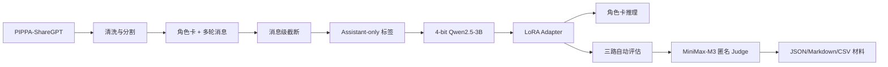

# 项目实现总览

## 1. 任务定义

输入角色卡和用户对话，模型以指定角色身份生成回复，并尽量在多轮对话中保持：

- 身份、背景和价值观一致；
- 语言风格与角色设定一致；
- 对上下文信息的记忆和连贯回应；
- 沉浸式表达，减少 AI 元话语和无关拒答。

项目以 `Qwen/Qwen2.5-3B-Instruct` 为基座，用 4-bit QLoRA 完成参数高效微调。

## 2. 系统架构



## 3. 主要模块

| 文件 | 作用 | 关键实现 |
|---|---|---|
| `scripts/data_loader.py` | 数据下载、清洗、划分和编码 | PIPPA 转 chat messages、去重、消息级截断、多轮窗口、assistant-only labels |
| `scripts/train.py` | QLoRA 训练入口 | NF4 量化、LoRA 注入、Trainer、benchmark、checkpoint、manifest |
| `scripts/run_training.sh` | 统一训练命令 | Conda 激活、资源检查、冒烟测试、50-step 预检、断点续训 |
| `scripts/prepare_training.sh` | 首次环境准备 | 固定依赖、检查 GPU、准备模型和数据 |
| `scripts/resource_manager.py` | 模型与数据资源管理 | 完整性校验、本地缓存发现、HF/ModelScope 回退、数据解析校验 |
| `scripts/inference.py` | 角色卡推理演示 | Adapter 加载、角色卡格式化、交互和批量采样 |
| `scripts/eval.py` | 三路对比评估 | 样本选择、生成、PPL、Judge、Bootstrap CI、断点续跑、基线复用 |
| `scripts/clean_training_data.py` | 后续数据清洗 | 过滤重复句和高 4-gram 重复，保持 test 不变 |
| `configs/experiments/*.yaml` | 实验配置 | `train_1` 至 `train_6` 的受控变量设计 |
| `configs/character_cards/*.json` | 推理角色卡 | 姓名、人设、背景、外貌、说话风格和示例 |
| `tests/` | 单元测试 | 数据、截断、配置、推理、资源管理、评估恢复与复用 |

## 4. 已实现的训练能力

- 4-bit NF4 加载基座模型，启用 double quantization 和 FP16 计算。
- 冻结基座参数，仅训练注意力投影层的 LoRA 矩阵。
- 默认 LoRA：`r=8`、`alpha=16`、dropout `0.05`，目标层为
  `q_proj/k_proj/v_proj/o_proj`。
- 可训练参数 3,686,400，占 3.09B 模型约 0.1193%。
- batch size 1、梯度累积 8、梯度检查点、8-bit paged AdamW。
- 支持 10-step smoke test、50-step 时间预估、checkpoint 恢复和最佳模型选择。
- 每次运行记录 Git commit、Python/PyTorch/CUDA/GPU、完整配置、数据 SHA256、
  样本数、训练耗时和 Trainer 指标。

最终 Adapter 文件约 14.8 MB，显著小于完整基座权重，适合小组共享和部署。

## 5. 已实现的数据能力

原始格式包含 `bot` 角色信息和 `conversations`：

```text
bot.description -> system
human           -> user
gpt             -> assistant
```

处理流程会过滤无角色描述、缺少 human/gpt、过长或完全重复的对话，并构造：

```text
Character name: <name>
<description>
```

作为 system 角色卡。训练 loss 只覆盖 assistant token，system、user 和 padding
均设置为 `-100`。

当前实现的消息级截断会：

1. 始终保留完整 system 角色卡；
2. 删除最后一个 assistant 回复之后的无监督尾部；
3. 从最旧对话开始按消息边界删除；
4. 至少保留最近的完整 user-assistant 后缀；
5. 当角色卡和最后一组问答已超限时，将长度视为软预算。

为改善多轮训练分布，新增的 `assistant_windows` 策略会把同一段对话拆成多个
assistant turn 窗口。每个窗口以某个 assistant 回复为目标，只监督该目标回复，
上下文则保留角色卡和目标前的最近完整消息后缀。默认策略仍是原来的
`conversation_suffix`，因此历史实验可复现。

## 6. 已实现的评估能力

评估同时运行：

- `Base, no card`
- `Base + card`
- `LoRA + card`

并输出：

- assistant reference PPL；
- Distinct-1/2、bigram 重复率、拒答率；
- 延迟、tokens/s、GPU 峰值显存；
- 单轮五维 Judge；
- 四轮身份、记忆、连贯性、风格和沉浸感 Judge；
- 配对差异、Bootstrap 95% CI、胜率、Judge 成功率和顺序一致性。

生成和 Judge 均逐样本写盘。中断后 `--resume` 只补缺失部分；多次 LoRA
实验可在严格校验配置与样本内容后通过 `--reuse_baseline` 复用基座回答。

## 7. 产出清单

### 模型与训练产出

- 六个完整 LoRA Adapter：`output/experiments/train_1` 至 `train_6`。
- 每轮 checkpoint、tokenizer、训练参数、运行清单和部分 console log。
- `train_1/train_3/train_4` 的 50-step benchmark。

### 评估产出

- 六轮三系统逐样本单轮和多轮生成。
- 六份 `summary.json`、`report.md` 和 `manifest.json`。
- 排除样本和 Judge 失败记录。
- 统一核心指标表 `paper_materials/experiment_comparison.csv`。

### 展示产出

- 根目录论文草稿 `REPORT.md`。
- `poster/poster.html` 工作版 Poster。
- `poster/prompt-interaction-flow*.png` 三个流程图版本。
- 五张示例角色卡：Alina、Gandalf、Harry Potter、Hermione、Luo Ji。

## 8. 当前实现边界

- `scripts/eval.py` 的多轮评估会传递完整历史，能够真实测试四轮记忆。
- `scripts/inference.py` 虽维护 `conversation_history`，当前 `chat()` 只接收本轮
  用户输入，因此交互演示实际仍是单轮生成。
- `InferenceConfig` 默认指向已删除的 `configs/lora_config.yaml`，未显式传入
  配置时当前推理命令会缺少默认配置文件。
- 这些问题不影响已归档训练和 `eval.py` 多轮结果，但最终演示前应单独修复。
