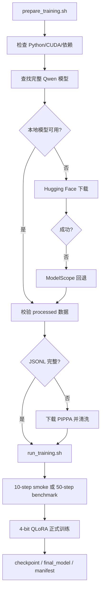
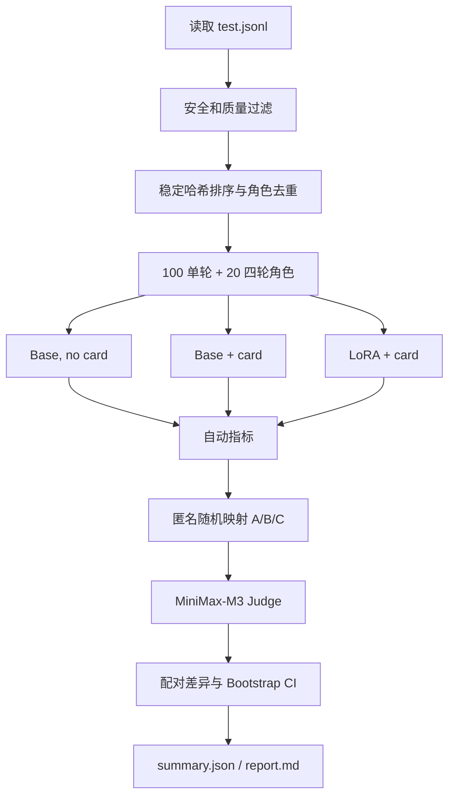

# 训练与评估流程设计

## 1. 训练流程

### 1.1 数据准备

数据源为 `KaraKaraWitch/PIPPA-ShareGPT-formatted`。设计目标是：

- 删除格式无效、过长和完全重复的对话；
- 按角色/对话组划分 train、validation、test，降低泄漏；
- 使用固定 seed `42`；
- 将角色描述放入 system prompt；
- 只对 assistant 回复计算 loss。

当前磁盘快照共有 11,515 条：

| Split | Rows | 平均对话消息数 | 平均 assistant 消息数 | 平均角色描述字符数 |
|---|---:|---:|---:|---:|
| Train | 9,211 | 9.27 | 5.31 | 378.64 |
| Validation | 1,152 | 9.28 | 5.30 | 378.36 |
| Test | 1,152 | 9.35 | 5.36 | 372.02 |

正式实验每次从对应训练快照中以 seed 42 选择最多 4,000 条训练样本和 200 条
验证样本。不同实验的数据哈希并不完全相同，详见
`reproducibility_audit.md`。

### 1.2 QLoRA 配置

| 类别 | 设置 |
|---|---|
| Base model | Qwen2.5-3B-Instruct |
| Quantization | 4-bit NF4, double quantization |
| Compute dtype | FP16 |
| LoRA targets | q/k/v/o projection |
| LoRA rank / alpha | 8 / 16 |
| LoRA dropout | 0.05 |
| Batch / accumulation | 1 / 8 |
| Optimizer | `paged_adamw_8bit` |
| Scheduler | cosine |
| Weight decay | 0.01 |
| Gradient checkpointing | enabled |
| Train/eval samples | 4000 / 200 |
| Seed | 42 |

### 1.3 实验矩阵

| 实验 | 上下文 | 截断 | LR | Epoch | Warmup | 目的 |
|---|---:|---|---:|---:|---:|---|
| `train_1` | 512 | 旧 token 左截断 | `2e-4` | 1 | 0.03 | 初始基线 |
| `train_2` | 512 | 保留角色卡、消息级截断 | `2e-4` | 1 | 0.03 | 截断消融 |
| `train_3` | 1024 | 保留角色卡、消息级截断 | `2e-4` | 1 | 0.03 | 上下文消融 |
| `train_4` | 1024 | 同 `train_3` | `1e-4` | 2 | 0.05 | 优化强度与重复率 |
| `train_5` | 1024 | 同 `train_4` | `1e-4` | 2 | 0.05 | 清洗数据运行清单 |
| `train_6` | 1024 | assistant 窗口 | `1e-4` | 1 | 0.05 | 多轮训练改进 |

`train_4` 每轮评估，按 `eval_loss` 加载最佳 checkpoint。第一轮验证 loss 为
2.359，第二轮为 2.362，最终选择第一轮模型。

`train_5` 每轮评估，第一轮验证 loss 为 2.315，第二轮为 2.299，最终选择第二轮
模型。训练清单记录 `data_dir=processed_clean`，但 hash 与当前 `processed/`
一致、与当前本地 `processed_clean/cleaning_manifest.json` 不一致，因此论文中
应把它写成“清洗数据运行清单”，不能写成严格的清洗单变量因果实验。

`train_6` 使用 `assistant_windows`，1 epoch 产生 5198 个训练窗口和 650 个
optimizer steps，验证 loss 为 2.258。它的评估结果显示 memory 维度小幅提高，
但单轮胜率和多轮综合没有优于 `train_5`。

### 1.4 多轮窗口改进

原训练流程每条原始对话只产生一个样本：保留 system 角色卡和最近能放入
`max_seq_length` 的完整后缀，并监督其中所有 assistant token。该做法计算简单，
但长对话的早期和中期回复经常被截掉，训练分布偏向最后一段上下文。

新增 `sample_strategy: assistant_windows` 后，每条对话可生成最多 3 个 assistant
turn 窗口，默认覆盖前期、中期和后期目标回复。每个窗口保留角色卡和目标回复前
的最近上下文，但只监督该窗口末尾的目标 assistant 回复。这样模型在训练时会更多
看到“带历史的下一轮回复”任务，预期比单个最近后缀更贴近多轮评估。

### 1.5 后续实验设计

| 实验 | 相对基线的单变量 |
|---|---|
| `train_6` | 在 `train_5` 上改用 assistant turn 多窗口训练，已完成但未改善多轮综合 |

清洗规则过滤 assistant 回复中至少重复 3 次的句子，或 4-gram 重复率不低于
0.35 且至少含 20 个 4-gram 的样本；test 集保持不变。

## 2. 评估流程

### 2.1 样本选择

- 对 test 集使用 `sha256(seed:sample_id)` 稳定排序；
- 过滤安全词命中、无有效最后一轮问答、缺少角色卡的样本；
- 每个角色只保留一个样本；
- 单轮取最后一个 assistant 回复作为 reference，前文作为 context；
- 多轮从前 20 个合格角色构造固定四轮挑战。

四轮挑战依次测试自我介绍与背景、价值观、信息记忆、回忆并继续保持角色。

### 2.2 三路系统

| 系统 | 角色卡 | LoRA | 用途 |
|---|---|---|---|
| Base, no card | 否 | 否 | 无角色条件下限 |
| Base + card | 是 | 否 | Prompting 强基线 |
| LoRA + card | 是 | 是 | 微调增益 |

主比较必须是 `LoRA + card` 对 `Base + card`。`Base + card` 对
`Base, no card` 用于估计角色卡提示本身的贡献。

三路回答均采用 greedy decoding：`do_sample=false`、最多 256 个新 token。

### 2.3 自动指标

- **Assistant PPL**：只对 reference assistant token 计算，并复用训练截断逻辑。
- **Distinct-1/2**：生成回复中不同 unigram/bigram 的比例。
- **Repetition**：重复 bigram 占全部 bigram 的比例。
- **Refusal**：空回复或命中中英文 AI/拒答短语。
- **Performance**：延迟、tokens/s、GPU 峰值显存。

PPL 评估模型对参考回复分布的拟合，不等同于角色扮演质量。

### 2.4 LLM Judge

候选系统通过稳定随机映射匿名为 A/B/C。MiniMax-M3 使用 1 至 5 分评分，
temperature 为 0，并要求输出严格 JSON。

单轮权重：

| Identity | Style | Relevance | Naturalness | Immersion |
|---:|---:|---:|---:|---:|
| 35% | 20% | 20% | 15% | 10% |

多轮权重：

| Identity | Memory | Coherence | Style | Immersion |
|---:|---:|---:|---:|---:|
| 25% | 25% | 20% | 15% | 15% |

### 2.5 统计设计

- 对每个均值和配对差异进行 1,000 次 Bootstrap，报告 95% CI。
- 胜率由 Judge 的完整排序推导。
- 当前 schema 强制 A/B/C 严格排序，因此实现中 tie rate 恒为 0。
- 约每 10 条样本更换匿名顺序复评，比较 top-1 是否一致。
- 报告 Judge API 成功率和失败样本数。

### 2.6 长任务可靠性

- 每完成一个系统生成或一次 Judge 调用，立即原子写入 JSONL。
- `--resume` 复用样本并只补缺失系统或缺失评分。
- Judge 失败写入 `judge_failures.jsonl`，恢复时可重试。
- `--skip_judge` 可只补自动指标。
- `--reuse_baseline` 校验模型名、配置、样本 ID 和样本内容后，只导入两组
  Base 回答，不导入旧 LoRA 和 Judge 结果。

## 3. 方法设计的核心价值

1. 三路消融把角色卡 prompting 与 LoRA 的效果分开。
2. assistant-only supervision 与 PPL mask 保持训练和评估口径一致。
3. 单轮和多轮分别测量即时角色拟合与长期一致性。
4. 自动指标与 Judge 互补，避免把低 PPL 误当作高角色质量。
5. 配对统计使用同一角色和同一输入，优于跨实验绝对均值比较。
